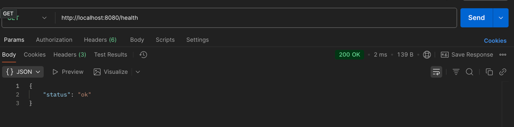
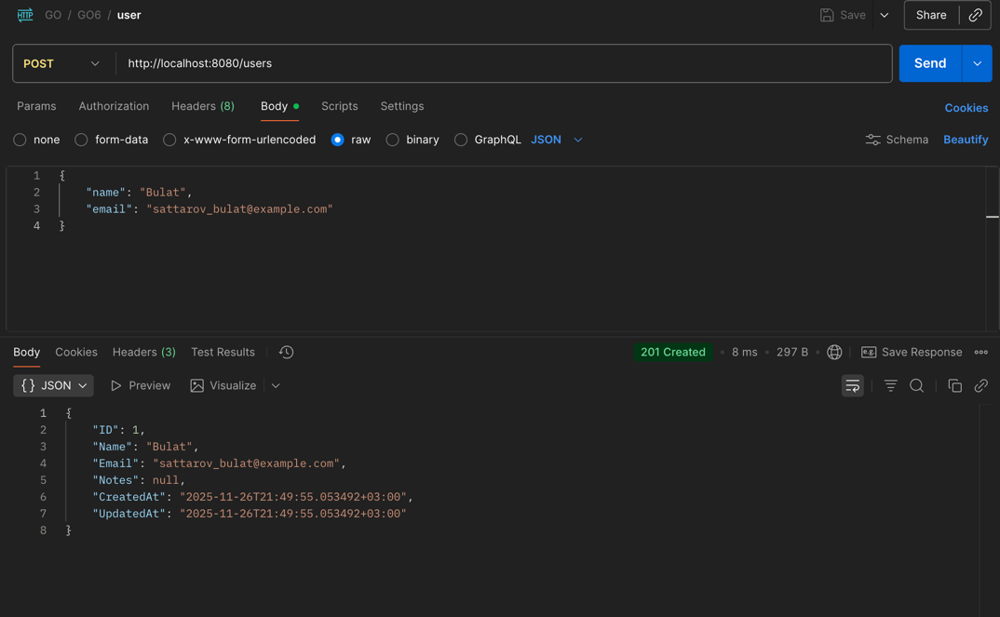
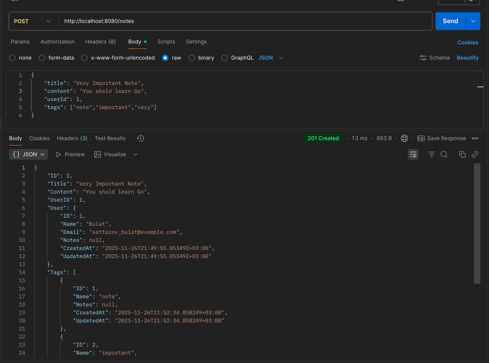
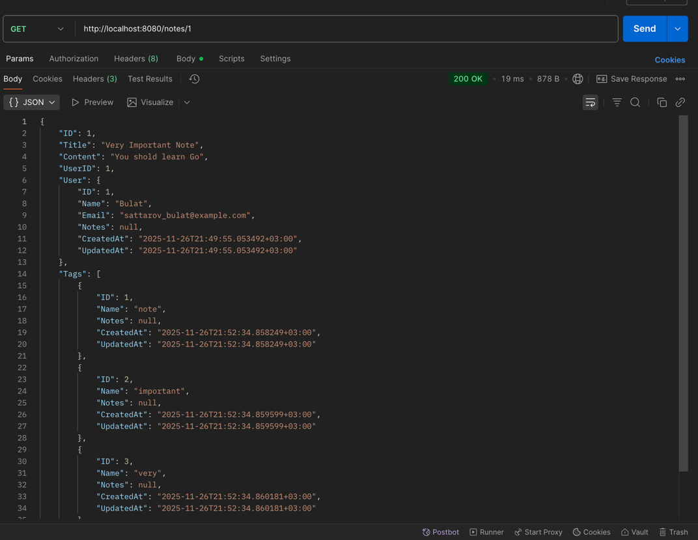
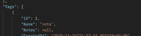
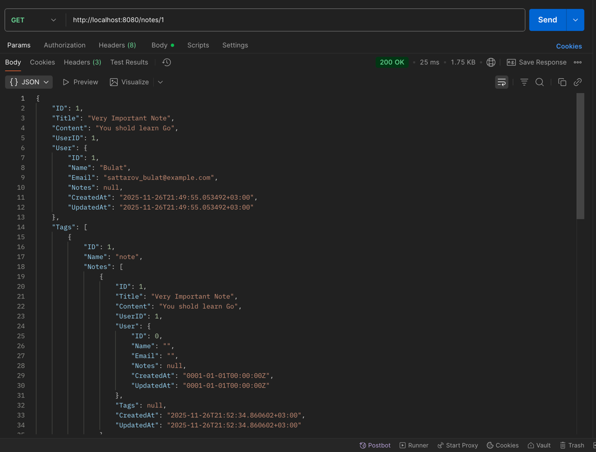

# Практическая работа #6
## Использование ORM (GORM). Модели, миграции и связи между таблицами.
## Саттаров Булат Рамилевич ЭФМО-01-25


## Окружение

- Go: v1.25.1
- PostgreSQL: v14
- ОС: macOS
- DB_DSN="host=127.0.0.1 user=postgres password=1 dbname=pz6_gorm port=5432 sslmode=disable"
---

### Зачем нужен ORM
ORM берет на себя шаблонный код, позволяя разработчику писать код на исходном языке, минуя SQL, также защищает от SQL-инъекций, обеспечивает поддержку миграций. 
### Чем помог GORM
- Автосоздание таблицы при отсутствии.
- CRUD операции
- Базовое преобразование данных (фильтры и сортировка)
- Автоподгрузка связанных данный через Preload

## Скриншоты

- Health check



- Новый пользователь



- Новая заметка



- Получение заметки по id



---

## Проблемы возникшие при выполнении работы
### Отсутствие переменной окружения
``` 
singularity@MacBook-Pro-Bulat pz6-gorm % go run cmd/server/main.go
2025/11/26 21:41:18 DB_DSN is empty
exit status 1
```

Решение: установка переменной окружения
```
pz6-gorm % DB_DSN="host=127.0.0.1 user=postgres password=1 dbname=pz6_gorm port=5432 sslmode=disable" go run ./cmd/server
```

### В ответе на запрос заметки поле notes возвращает null

Решение: Использовать вложенные Preload
``` go
if err := h.db.Preload("User").Preload("Tags.Notes").First(&note, id).Error; err != nil {
		writeErr(w, http.StatusNotFound, "note not found")
		return
	}
```

